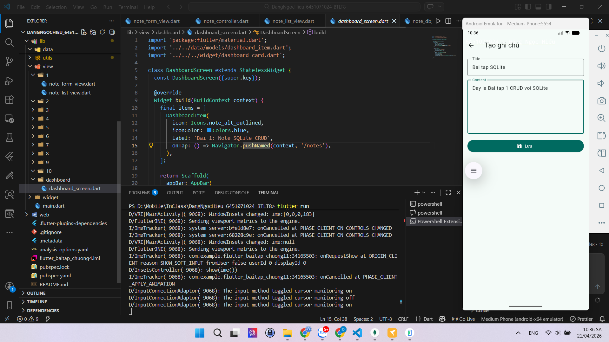
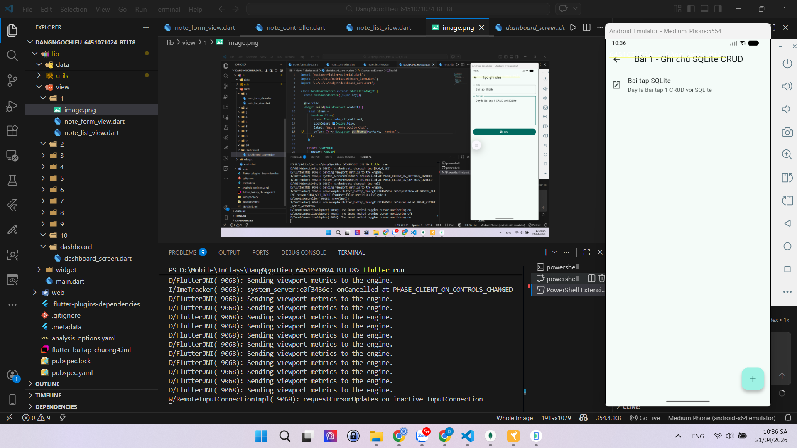
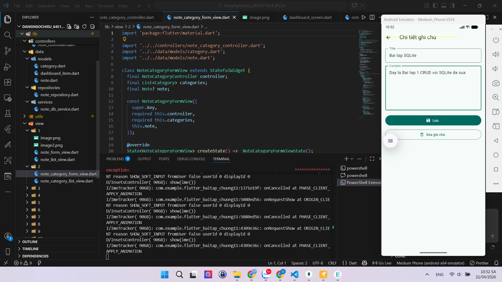

# Flutter Bài Tập SQLite Chương 11

**Sinh viên:** Đặng Ngọc Hiếu
**MSSV:** 6451071024
**Môn:** Lập Trình Ứng Dụng Trên Thiết Bị Di Động

---

## Cấu Trúc Thư Mục

```
lib/
├── main.dart
├── apps/
│   └── app.dart
├── controllers/
│   ├── note_controller.dart
│   └── note_category_controller.dart
├── data/
│   ├── models/
│   │   ├── category.dart
│   │   ├── dashboard_item.dart
│   │   └── note.dart
│   ├── repositories/
│   │   └── note_repository.dart
│   └── services/
│       └── note_db_service.dart
├── utils/
│   ├── constants.dart
│   └── validate.dart
├── widget/
│   ├── alertdialog_custom.dart
│   ├── button_custom.dart
│   ├── dashboard_card.dart
│   └── inputdecoration_custom.dart
└── view/
    ├── dashboard/
    │   └── dashboard_screen.dart
    ├── 1/
    │   ├── image.png
    │   ├── image2.png
    │   ├── image3.png
    │   ├── note_list_view.dart
    │   └── note_form_view.dart
    ├── 2/
    │   ├── note_category_list_view.dart
    │   ├── note_category_form_view.dart
    │   └── video.mp4
    ├── 3/
    ├── 4/
    ├── 5/
    ├── 6/
    ├── 7/
    ├── 8/
    ├── 9/
    └── 10/
```

---

## Danh Sách Bài Tập


### Bài 1: Ứng dụng Ghi chú cơ bản (SQLite CRUD)
- Ảnh 1


- Ảnh 2


- Ảnh 3


---

### Bài 2: Ghi chú có danh mục (SQLite có khóa ngoại)
- Video demo
<video controls>
  <source src="lib/view/2/video.mp4" type="video/mp4">
</video>
