# Flutter Bài Tập SQLite Chương 11

**Sinh viên:** Đặng Ngọc Hiếu
**MSSV:** 6451071024
**Môn:** Lập Trình Ứng Dụng Trên Thiết Bị Di Động

---

## Cấu Trúc Thư Mục

```
lib/
├── main.dart
├── apps/
│   └── app.dart
├── controllers/
│   ├── activity_log_controller.dart
│   ├── dictionary_controller.dart
│   ├── expense_controller.dart
│   ├── note_controller.dart
│   ├── note_category_controller.dart
│   ├── offline_image_controller.dart
│   ├── student_course_controller.dart
│   └── task_controller.dart
├── data/
│   ├── models/
│   │   ├── activity_log.dart
│   │   ├── category.dart
│   │   ├── category_total.dart
│   │   ├── course.dart
│   │   ├── dashboard_item.dart
│   │   ├── dictionary_entry.dart
│   │   ├── enrollment.dart
│   │   ├── expense.dart
│   │   ├── expense_category.dart
│   │   ├── note.dart
│   │   ├── offline_image.dart
│   │   ├── student.dart
│   │   ├── student_course_info.dart
│   │   └── task.dart
│   ├── repositories/
│   │   ├── activity_log_repository.dart
│   │   ├── dictionary_repository.dart
│   │   ├── expense_repository.dart
│   │   ├── note_repository.dart
│   │   ├── offline_image_repository.dart
│   │   ├── student_course_repository.dart
│   │   └── task_repository.dart
│   └── services/
│       ├── activity_log_db_service.dart
│       ├── activity_log_file_service.dart
│       ├── dictionary_db_service.dart
│       ├── expense_db_service.dart
│       ├── note_db_service.dart
│       ├── offline_image_service.dart
│       ├── student_course_db_service.dart
│       ├── task_db_service.dart
│       └── task_file_service.dart
├── utils/
│   ├── constants.dart
│   └── validate.dart
├── widget/
│   ├── alertdialog_custom.dart
│   ├── button_custom.dart
│   ├── dashboard_card.dart
│   └── inputdecoration_custom.dart
└── view/
    ├── dashboard/
    │   └── dashboard_screen.dart
    ├── 1/
    │   ├── image.png
    │   ├── image2.png
    │   ├── image3.png
    │   ├── note_list_view.dart
    │   └── note_form_view.dart
    ├── 2/
    │   ├── note_category_list_view.dart
    │   ├── note_category_form_view.dart
    │   └── video.mp4
    ├── 3/
    │   ├── task_list_view.dart
    │   └── image.png
    ├── 4/
    │   ├── expense_list_view.dart
    │   ├── expense_form_view.dart
    │   ├── image.png
    │   ├── image2.png
    │   ├── image3.png
    │   └── image4.png
    ├── 5/
    │   ├── dictionary_view.dart
    │   ├── image.png
    │   └── image2.png
    ├── 6/
    │   ├── offline_gallery_view.dart
    │   └── image.png
    ├── 7/
    │   ├── student_course_view.dart
    │   ├── image.png
    │   └── image2.png
    ├── 8/
    │   ├── activity_log_view.dart
    │   └── image.png
    ├── 9/
    └── 10/
```

---

## Danh Sách Bài Tập


### Bài 1: Ứng dụng Ghi chú cơ bản (SQLite CRUD)
- Ảnh 1


- Ảnh 2


- Ảnh 3


---

### Bài 2: Ghi chú có danh mục (SQLite có khóa ngoại)
- Video demo
<video controls>
  <source src="lib/view/2/video.mp4" type="video/mp4">
</video>

[Xem video demo](lib/view/2/video.mp4)

https://github.com/user-attachments/assets/eaa95967-c1cb-4835-86af-03adba8fba12

---

### Bài 3: To-do list và lưu backup JSON (SQLite + File)
- Ảnh demo
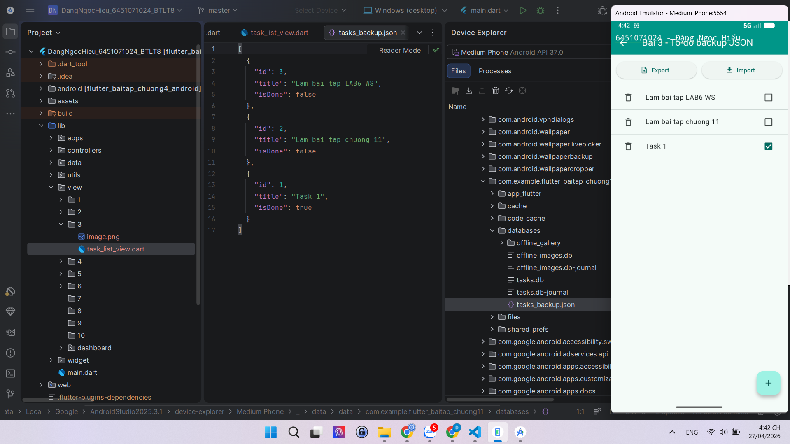

---

### Bài 4: Quản lý chi tiêu (SQLite nhiều bảng)
- Ảnh 1
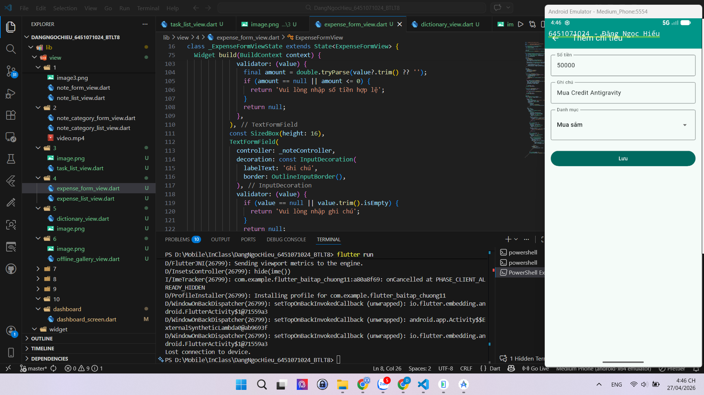

- Ảnh 2
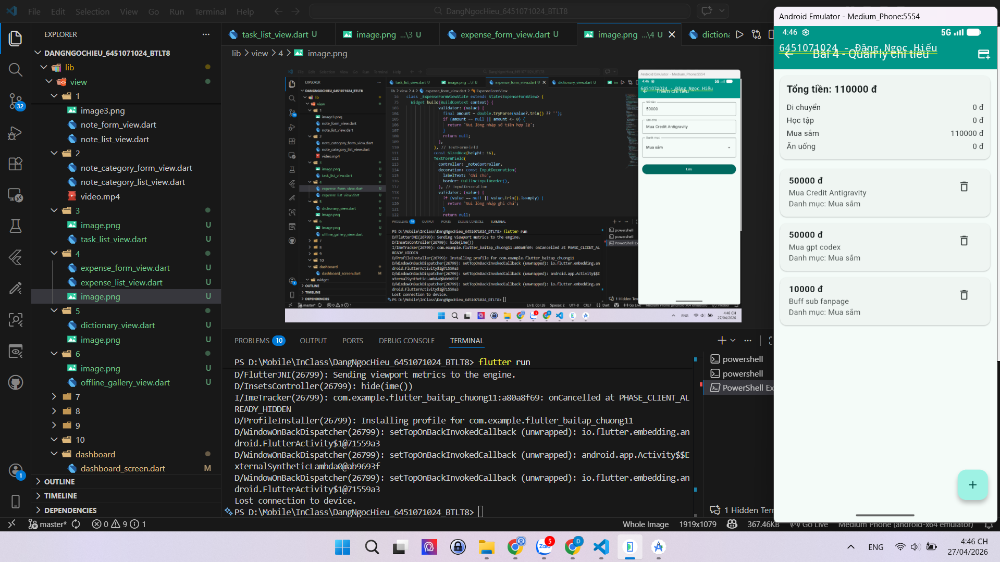

- Ảnh 3
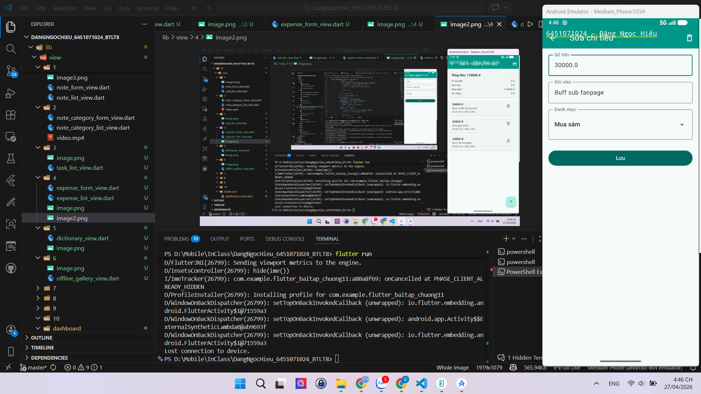

- Ảnh 4
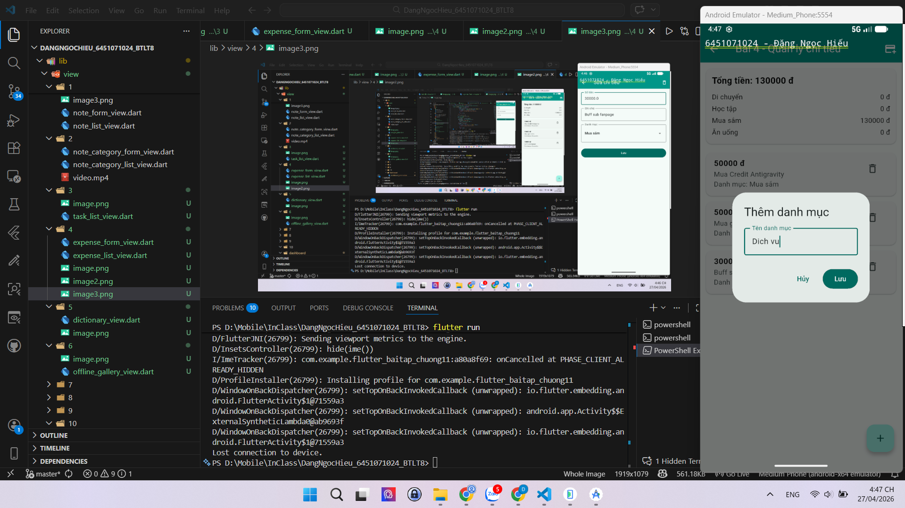

---

### Bài 5: Từ điển offline (File JSON + SQLite)
- Ảnh 1
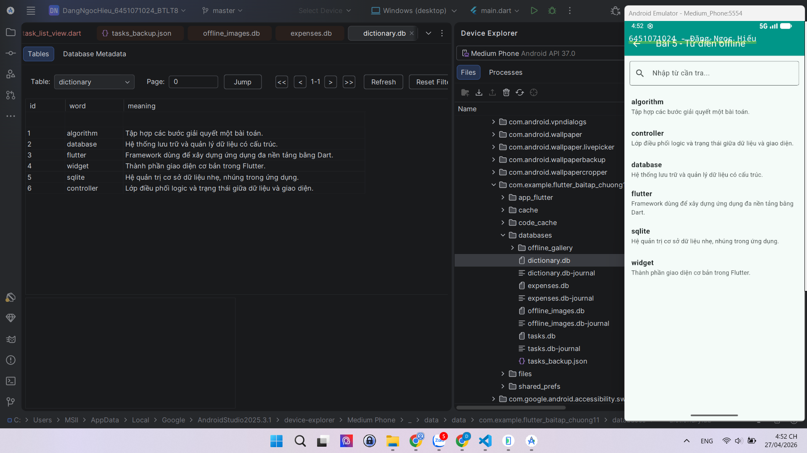

- Ảnh 2
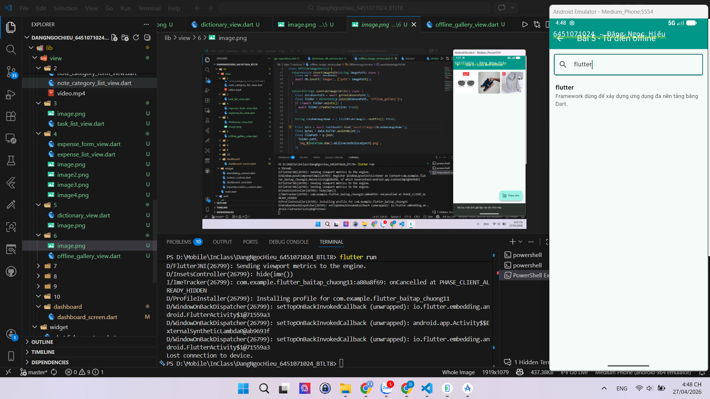

---

### Bài 6: Lưu ảnh offline (File + SQLite)
- Ảnh demo
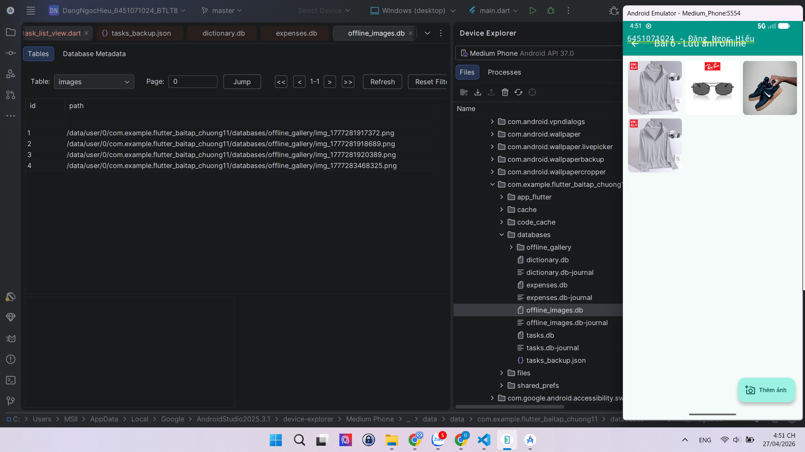

---

### Bài 7: Quản lý sinh viên - môn học (quan hệ nhiều-nhiều)
- Ảnh 1
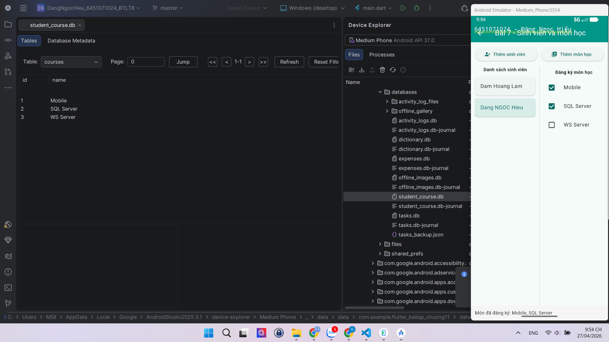

- Ảnh 2
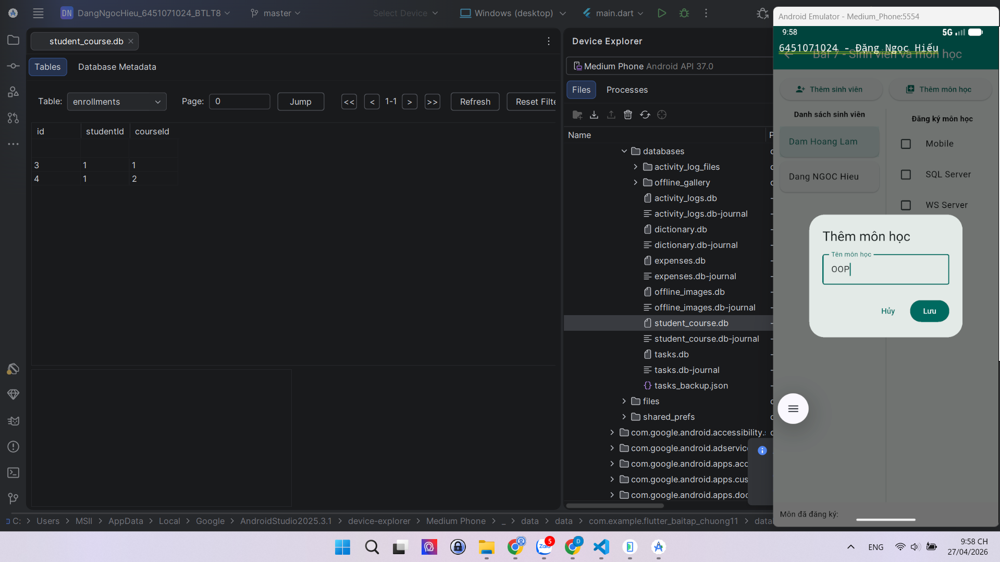

---

### Bài 8: Nhật ký hoạt động (SQLite + File log)
- Ảnh demo
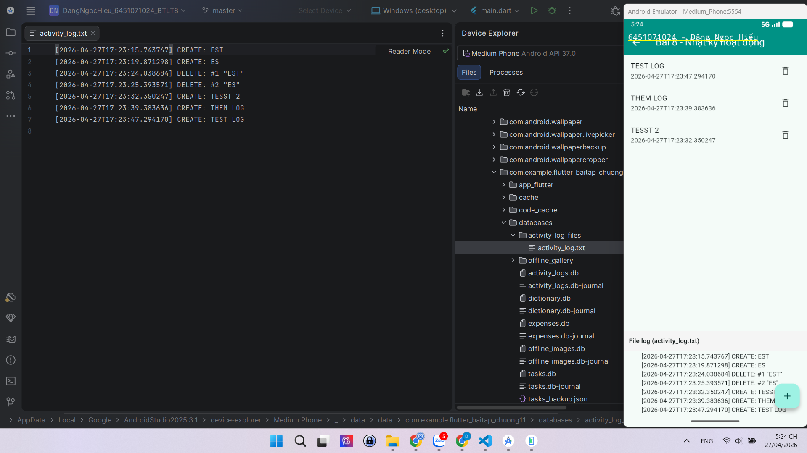


